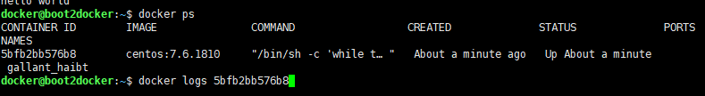

本页目录：
- 1、[启动容器（后台模式）](#docker-01)
- 2、[测试](#docker-02)

***

## 启动容器（后台模式） <a name="docker-01" href="#" >:house:</a>

- 以进程方式运行的容器

```
docker run -d centos:7.6.1810 /bin/sh -c "while true; do echo hello world; sleep 1; done"
```

## 测试 <a name="docker-02" href="#" >:house:</a>

- 确认容器是否运行

```
docker ps
```

- 查看容器内的标准输出

```
# docker logs 加上运行容器的CONTAINER ID或者NAMES
docker logs 5bfb2bb576b8
# 或者
docker logs gallant_haibt
```



- 停止

```
docker stop 5bfb2bb576b8
# 或者
docker stop gallant_haibt
```

- 查看所有的容器

```
docker ps -a
或者
docker container ls --all
```

- 删除容器

```
docker rm -f 5bfb2bb576b8
# 或者
docker rm -f gallant_haibt
```


