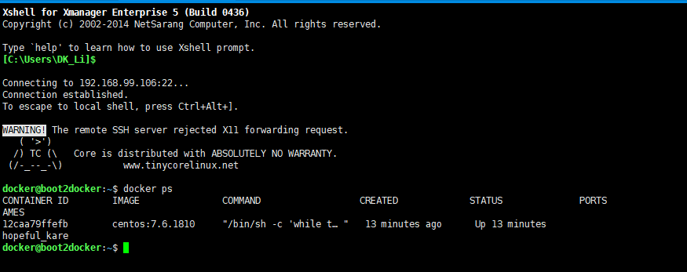

总操纵流程：
- 1、[进入容器](#docker-01)
- 2、[测试](#docker-02)

***

## 进入容器 <a name="docker-01" href="#" >:house:</a>

> 1、查看运行的容器

```
docker ps
```



> 2、进入容器中

```
docker exec -it 12caa79ffefb /bin/bash  
```

- 退出容器回到docker的命令

```
exit
```

- <kbd>Ctrl</kbd>+<kbd>D</kbd>快捷键方式退出

## 测试 <a name="docker-02" href="#" >:house:</a>

- 更新

```
yum -y update
```
