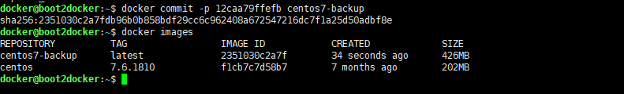
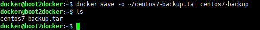
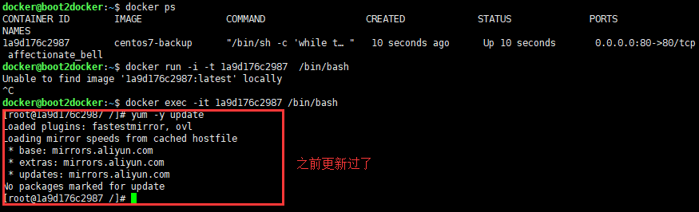

总操作流程：
- 1、[备份](#docker-01)
- 2、[还原](#docker-02)

***

## 备份 <a name="docker-01" href="#" >:house:</a>

> 1、查看运行的容器

```
docker ps
```


> 2、备份容器

```
docker commit -p 12caa79ffefb centos7-backup
```
> 3、查看备份的容器快照

```
docker images
```



> 4、打包成tar包备份

```
docker save -o ~/centos7-backup.tar centos7-backup

ls
```



## 还原 <a name="docker-02" href="#" >:house:</a>

> 1、停止现在的容器

```
docker stop 12caa79ffefb 
```

> 2、删除镜像

```
docker rmi centos7-backup
```

> 3、还原

```
docker load -i ~/centos7-backup.tar

docker images

docker run -d -p 80:80 centos7-backup

docker ps
```

- 4、测试

```
docker exec -it 1a9d176c2987 /bin/bash  

yum -y update
```

