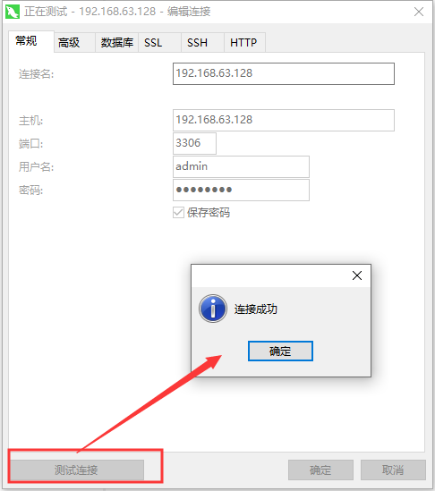

总操作流程：
- 1、[拉取](#docker-01)
- 2、[配置](#docker-02)
- 3、[测试](#docker-03)

***

## 拉取 <a name="docker-01" href="#" >:house:</a>

```shell
docker pull mysql:8.0.18
```

## 配置 <a name="docker-02" href="#" >:house:</a>

> 1、创建mysql容器

```
docker run --privileged=true --name myMysql -v /data/mysql:/var/lib/mysql -p 3306:3306 -e MYSQL_ROOT_PASSWORD=123456 -d mysql:8.0.18
```
- –privileged=true: CentOS系统下的安全Selinux禁止了一些安全权限，导致MySQL容器在运行时会因为权限不足而报错，所以需要增加该选项。
- -d 标识是让 docker 容器在后台运行。
- -p 标识通知 Docker 将容器内部使用的网络端口映射到我们使用的主机上。3306:3306 将容器的3306端口映射到本机的3306端口。
- --name 定义一个容器的名字，如果在执行docker run时没有指定Name，那么deamon会自动生成一个随机数字符串当做UUID。
- -e 设置环境变量，或者覆盖已存在的环境变量
- -v: 指定数据卷，也就是将我们MySQL容器的/var/lib/mysql映射到宿主机的/data/mysql

> 2、创建一个远程用户，并赋予权限，最后修改加密规则

```shell
# 查看运行的容器
docker ps 

# 进入容器中
docker exec -it 容器ID /bin/bash  

# 连接mysql
mysql -u root -p
```

```shell
mysql> CREATE USER 'admin'@'%' IDENTIFIED BY '123456';
mysql> flush privileges;
# 创建数据库
mysql> create database wordpress;
mysql> GRANT all privileges ON wordpress.* TO 'admin'@'%' WITH GRANT OPTION;
mysql> flush privileges; 
# 修改加密规则
mysql> ALTER USER 'admin'@'%' IDENTIFIED BY '123456' PASSWORD EXPIRE NEVER;
#更新一下用户的密码 
mysql> ALTER USER 'admin'@'%' IDENTIFIED WITH mysql_native_password BY '123456';
#刷新权限 
mysql> FLUSH PRIVILEGES;
#再重置下密码
mysql> alter user 'admin'@'%' identified by '123456';
mysql> FLUSH PRIVILEGES;
mysql> quit;
```

> 3、宿主机防火墙对端口开放

```
firewall-cmd --permanent --zone=public --add-port=3306/tcp
firewall-cmd --reload
firewall-cmd --zone=public --query-port=3306/tcp #查看添加端口是否成功
```

## 测试 <a name="docker-03" href="#" >:house:</a>



