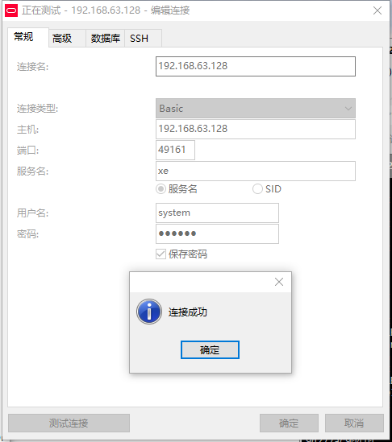

总操作流程：
- 1、[拉取](#docker-01)
- 2、[配置](#docker-02)
- 3、[测试](#docker-03)

***

## 拉取 <a name="docker-01" href="#" >:house:</a>

```
docker pull wnameless/oracle-xe-11g
```

## 配置 <a name="docker-02" href="#" >:house:</a>

> 1、创建Oracle容器

```
docker run -d -v /home/docker/data/oracle_data:/data/oracle_data -p 49160:22 -p 49161:1521 -e ORACLE_ALLOW_REMOTE=true --name oracle11g wnameless/oracle-xe-11g

```
- -d 标识是让 docker 容器在后台运行。
- -p 标识通知 Docker 将容器内部使用的网络端口映射到我们使用的主机上。
- -e oracle_allow_remote=true表示允许远程连接
- --name 定义一个容器的名字，如果在执行docker run时没有指定Name，那么deamon会自动生成一个随机数字符串当做UUID。

> 2、进入运行的容器

```

docker exec -it oracle11g /bin/bash  
```

> 3、宿主机防火墙对端口开放

```shell
firewall-cmd --permanent --zone=public --add-port=49161/tcp
firewall-cmd --reload
```

## 测试 <a name="docker-03" href="#" >:house:</a>

