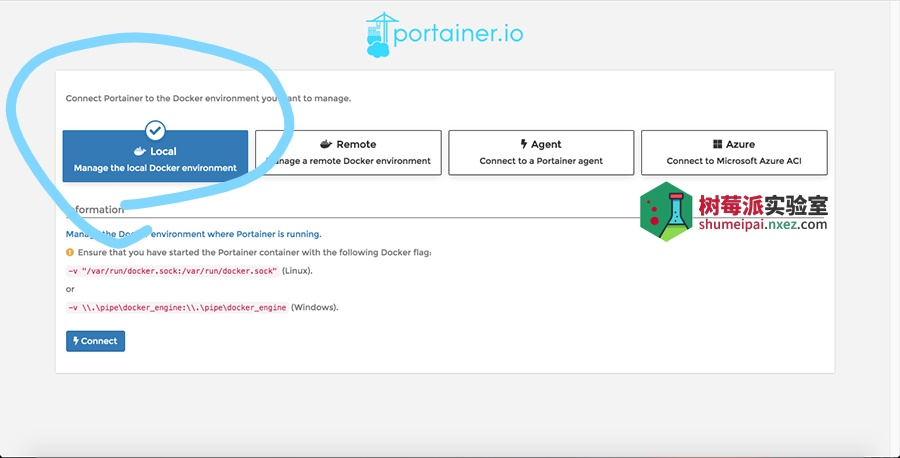

总操作流程：
- 1、下拉
- 2、配置
- 3、看效果

***

## 下拉

```shell
# 下载 Docker 图形化界面 portainer
docker pull portainer/portainer
# 创建 portainer 容器
docker volume create portainer_data
```
## 配置

> 运行 portainer

```
docker run -d -p 9000:9000 --name portainer --restart always -v /var/run/docker.sock:/var/run/docker.sock -v portainer_data:/data portainer/portainer
```

> 3、宿主机防火墙对端口开放

```shell
firewall-cmd --permanent --zone=public --add-port=9000/tcp
firewall-cmd --reload
```

## 看效果

> 浏览器输入地址:http://192.168.42.128:9000/

> 首次登录设置密码



- 镜像加速添加：选择Registries->点击Add registry->Custom registry 之后在name这里填aliyun表示这是阿里云的镜像站，url填你刚才复制下来的地址最后点击Add registry就好