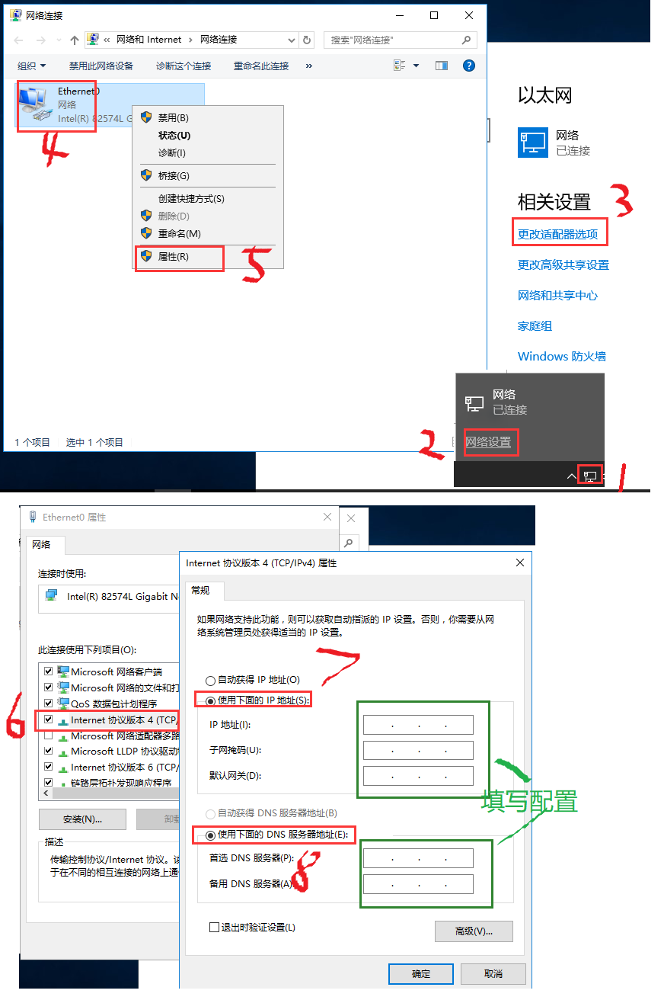

本页目录：
- 1、图形方式配置ip
- 2、命令方式配置ip

***

## 图形方式配置ip



## 命令方式配置ip

> 命令

```shell

# 进入命令输入界面
netsh

# 配置ip
ip set address "名字" static ip地址 子网掩码  网关

# 配置dns
ip set dnsserver "名字" static ip地址 子网掩码  网关

# 离开
quit

# 查看效果
ipconfig /all
```


