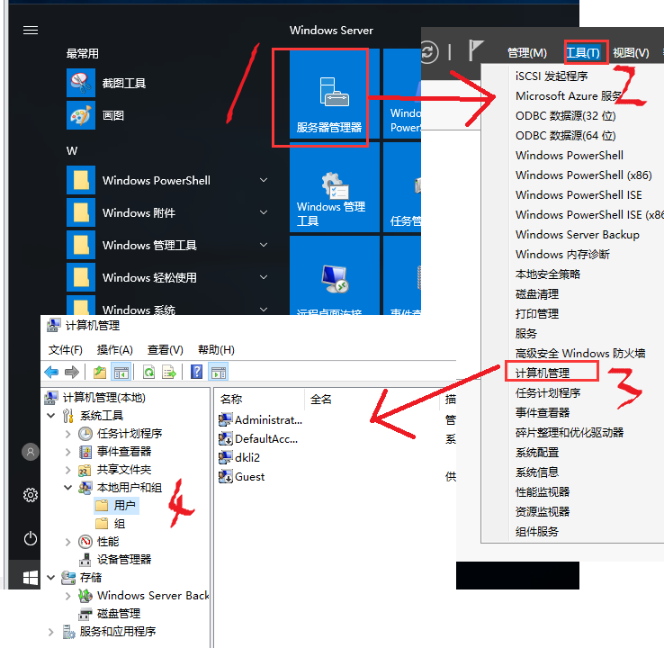
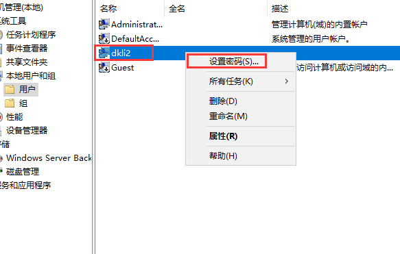
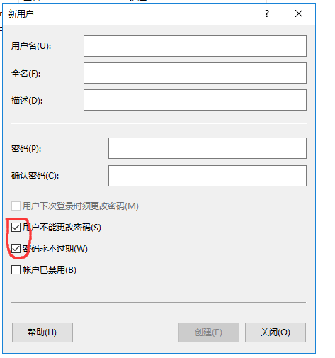
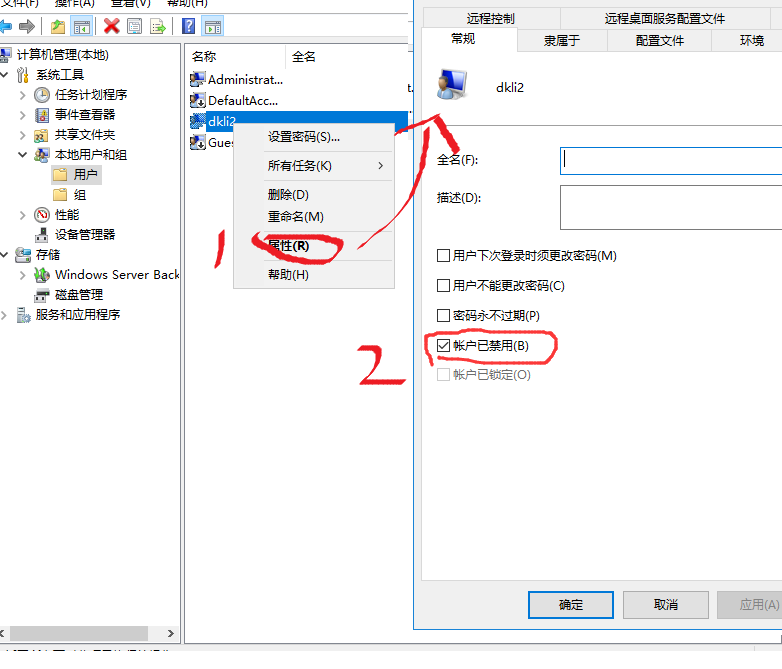
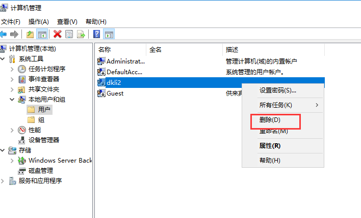
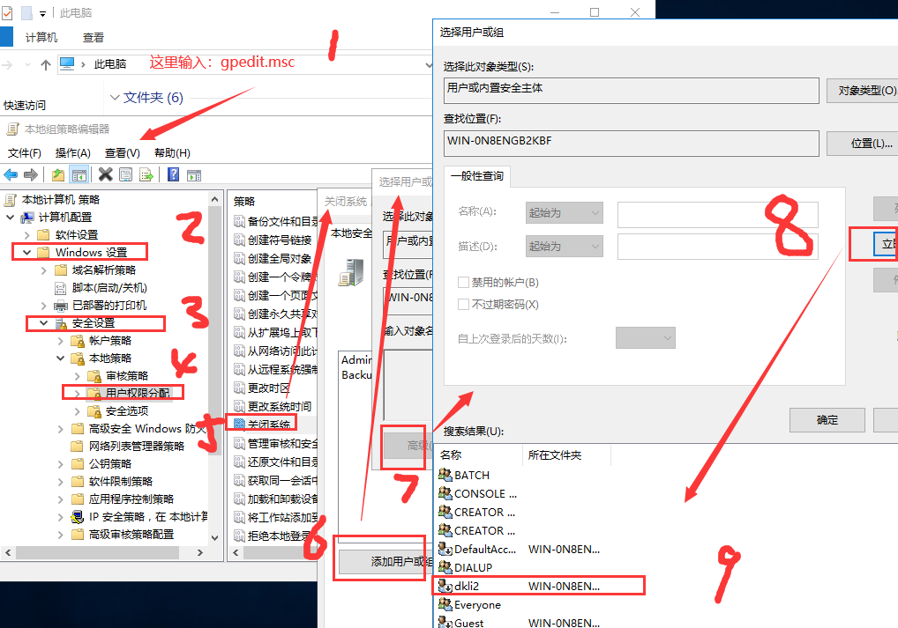

本页目录：
- 1、创建用户
- 2、修改用户密码
- 3、创建公用用户
- 4、禁用用户
- 5、删除用户
- 6、给用户关机/重启权限

***



## 创建用户

> 图形方式


> 命令方式

```shell
net user 用户名 密码 /add
```

## 修改用户密码



## 创建公用用户



## 禁用用户



## 删除用户

> 图形方式



> 命令方式

```shell
net user 用户名 /del
```

## 给用户关机/重启权限



> 执行使其生效


