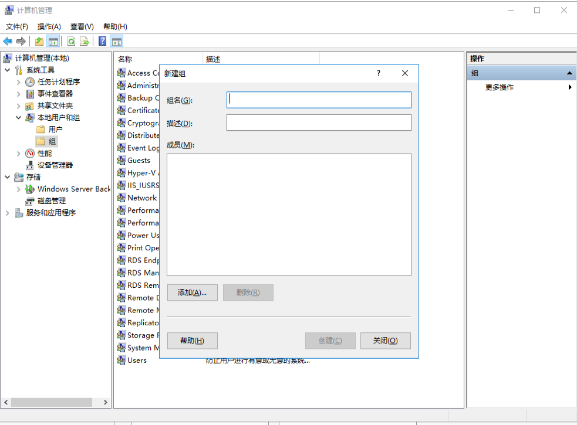
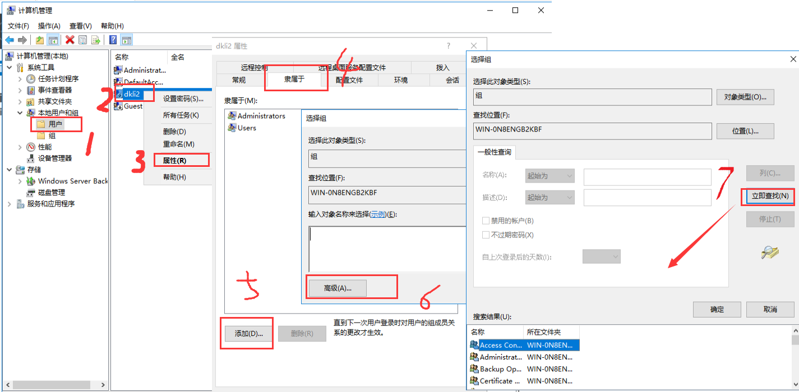
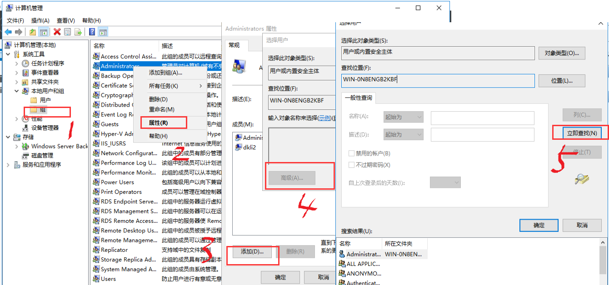

本页目录：
- 1、新建组
- 2、向组内添加成员
- 3、删除组

***

## 新建组

> 图形方式



> 命令方式

```
net localgroup 组名 /add
```

## 向组内添加成员

> 1、用户处添加组



> 2、组处添加组



- 命令方式

```shell
# 加入
net localgroup 组名 用户名 /add
# 激活
net user 用户名 /active:yes
# 删除
net localgroup 组名 用户名 /del

```

## 删除组

> 先删除组里的用户再删组

- 命令方式

```
net localgroup 组名 /del
```


