总操作流程：
- 1、创建用户和组
- 2、创建文件并受权
- 3、配置
- 4、看效果

***

- 注意：该实验在虚拟机情况下实践的

## 创建用户和组

> 创建用户

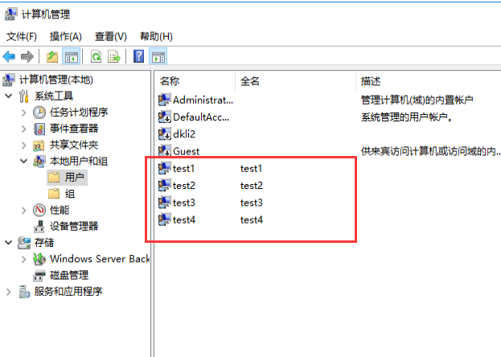

> 创建组

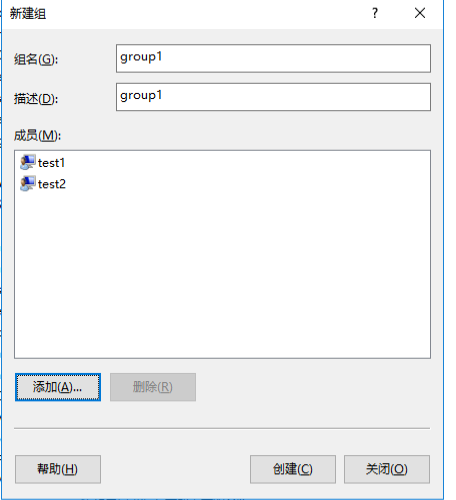

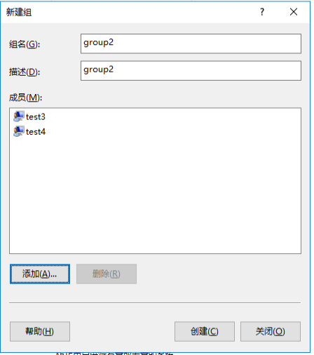

## 创建文件并授权

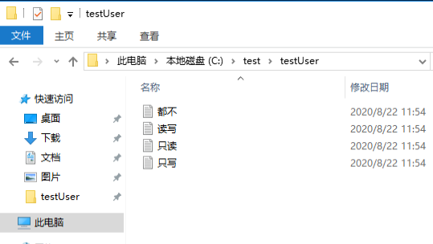

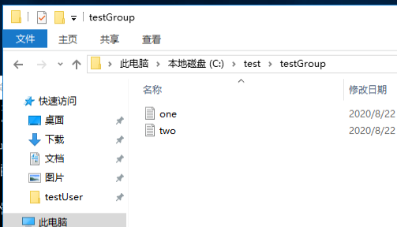

## 配置

> 共享文件夹

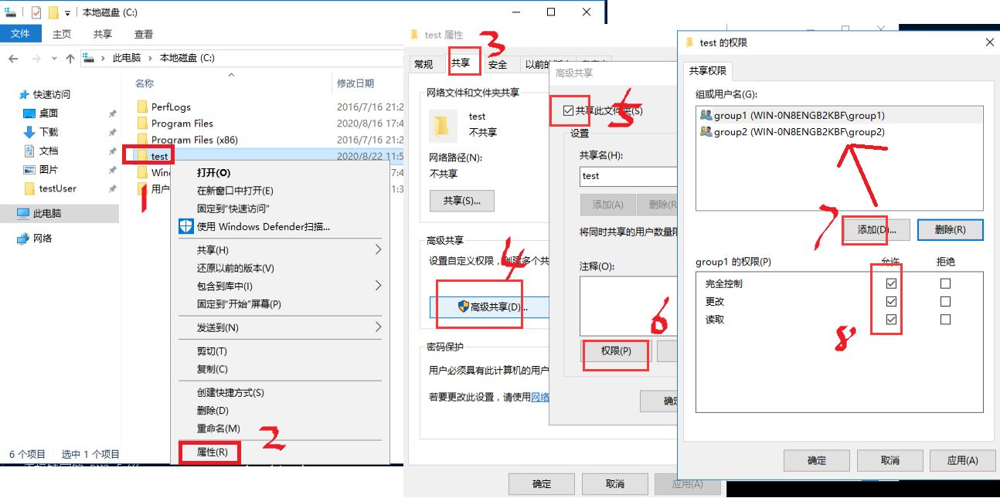

> 文件权限指定

- testUser：只读

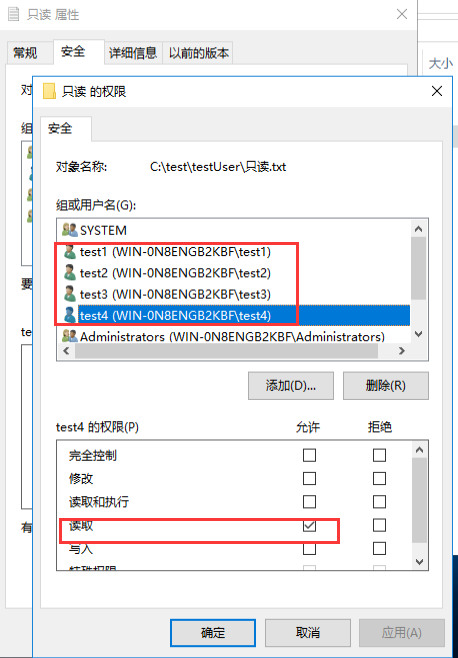

- testUser：读写

- testUser：都不

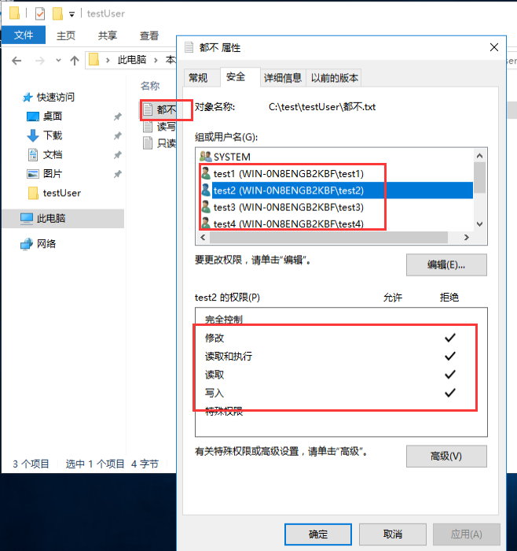

- testGroup：one

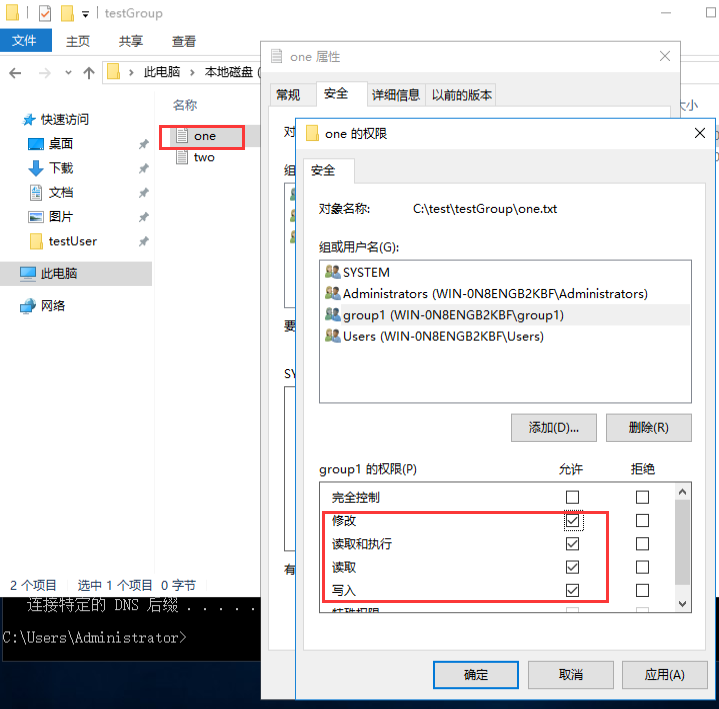

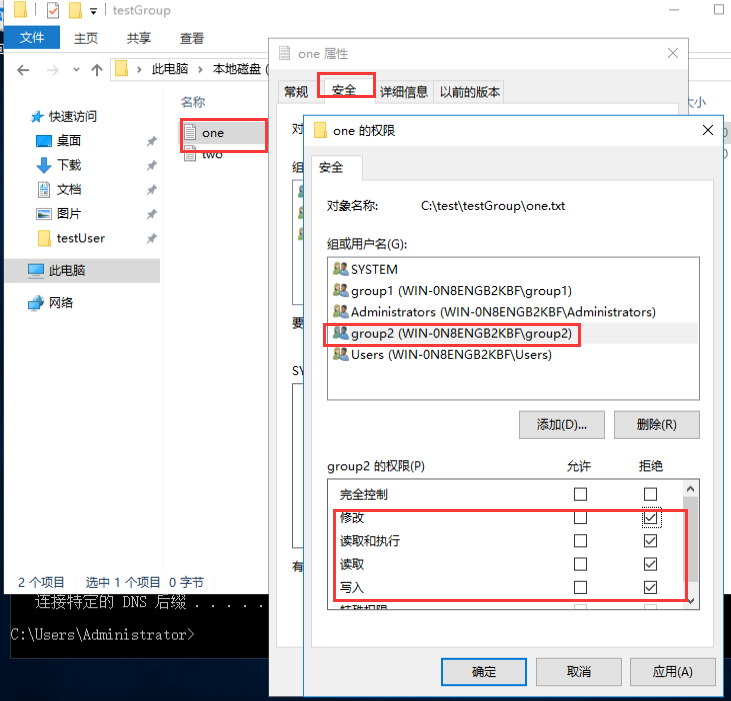

- testGroup：two

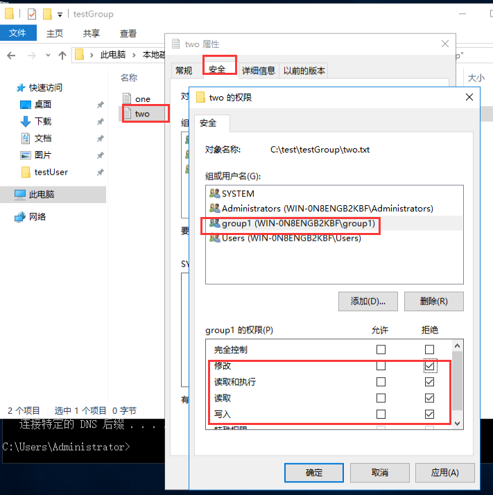

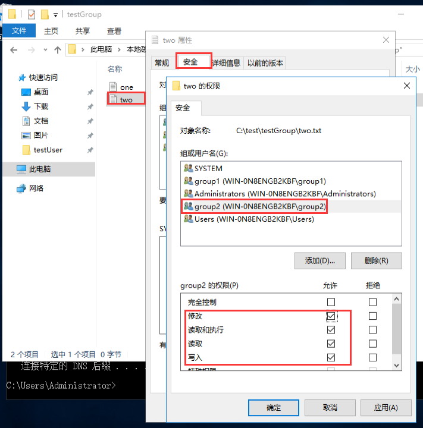

## 看效果

> \\ip地址

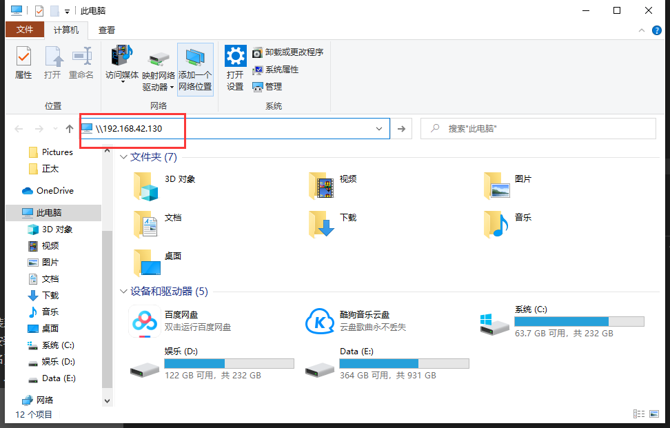

> 使用不同账号登录查看效果

