总操作流程：
- 1、[创建用户和组](#index-01)
- 2、[创建文件并受权](#index-02)
- 3、[配置](#index-03)
- 4、[看效果](#index-04)

***

- 注意：该实验在虚拟机情况下实践的

## 创建用户和组 <a name="index-01" href="#" >:house:</a>

> 创建用户

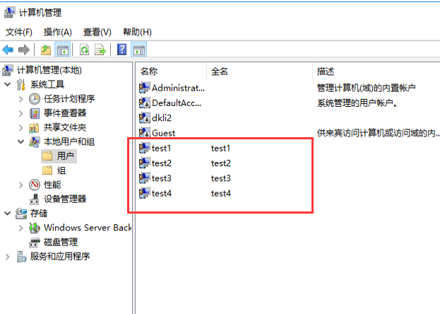

> 创建组

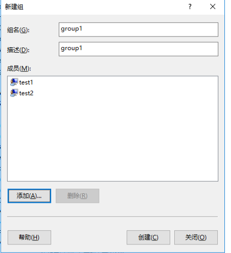

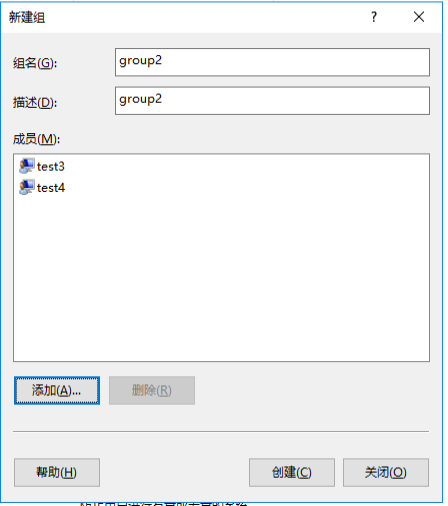

## 创建文件并授权 <a name="index-02" href="#" >:house:</a>

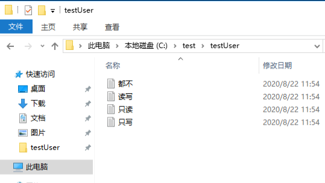

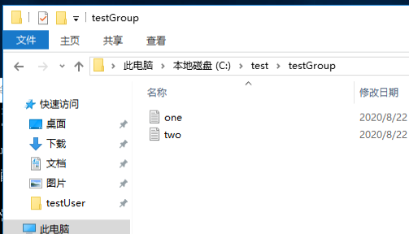

## 配置 <a name="index-03" href="#" >:house:</a>

> 共享文件夹

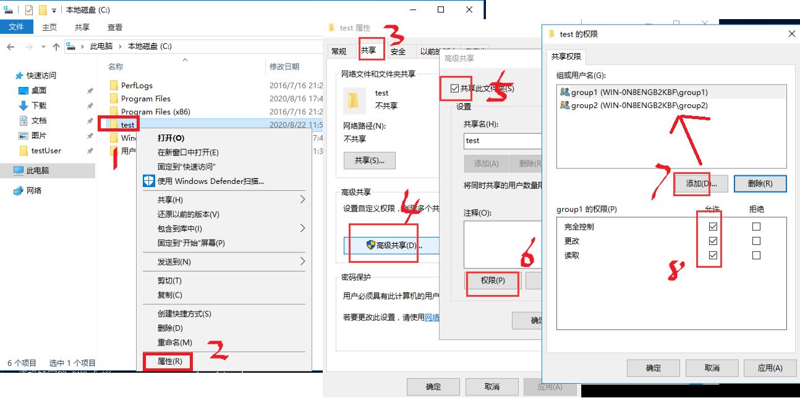

> 文件权限指定

- testUser：只读

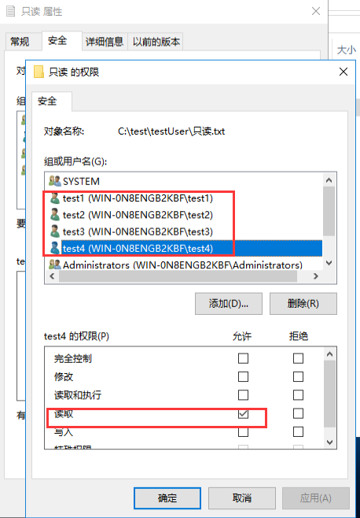

- testUser：读写

- testUser：都不

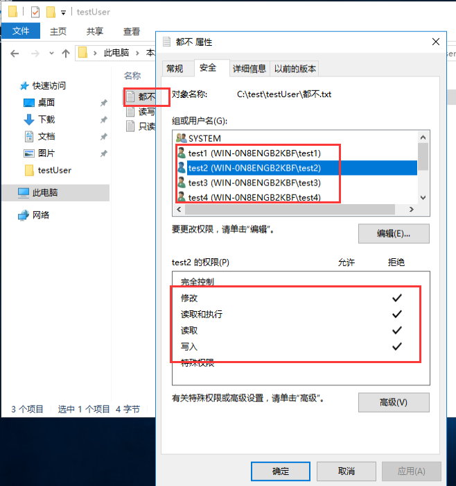

- testGroup：one

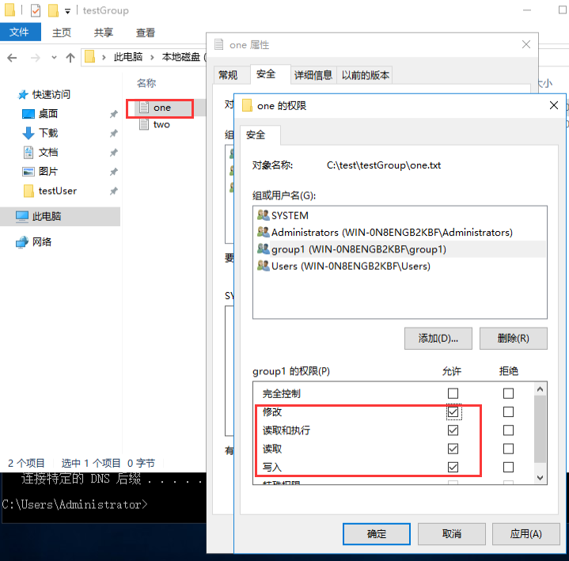

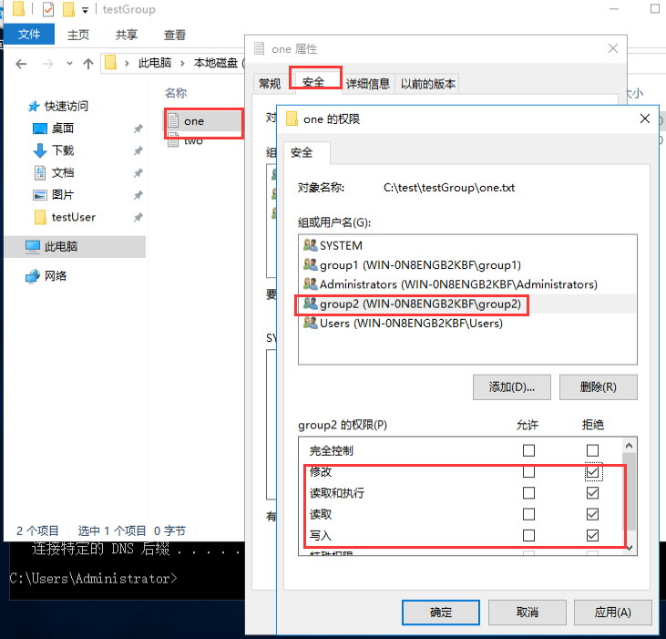

- testGroup：two

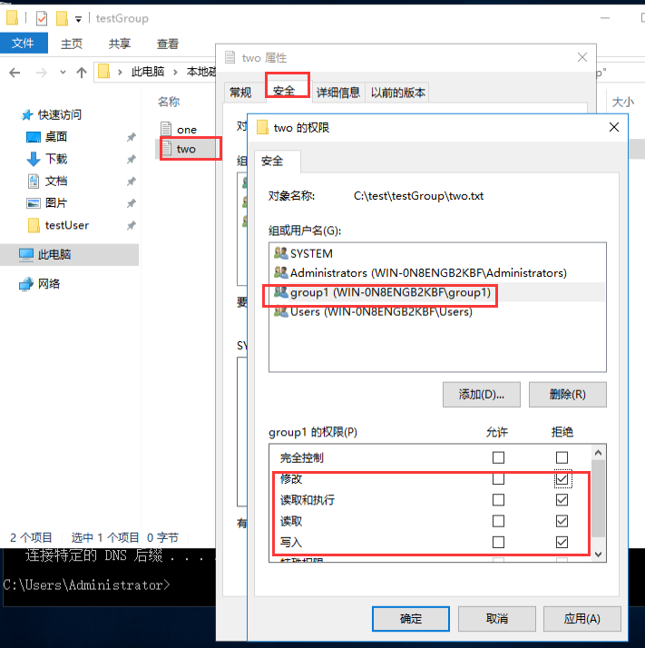

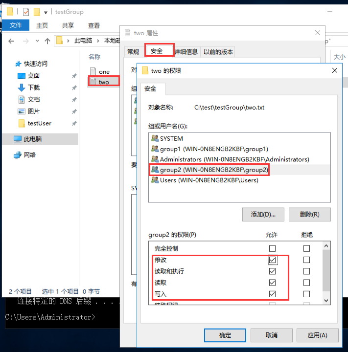

## 看效果 <a name="index-04" href="#" >:house:</a>

> \\ip地址

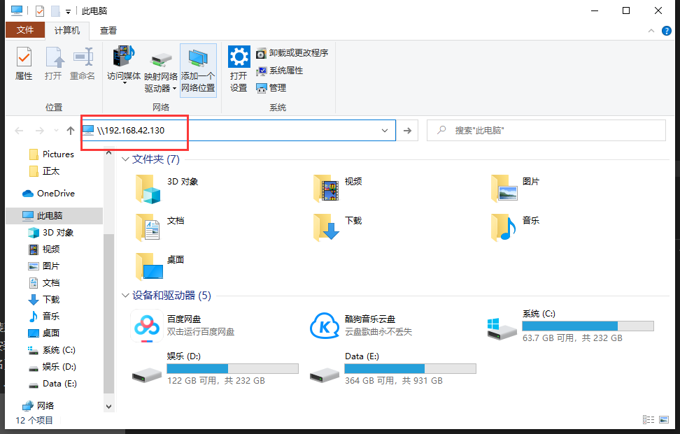

> 使用不同账号登录查看效果

