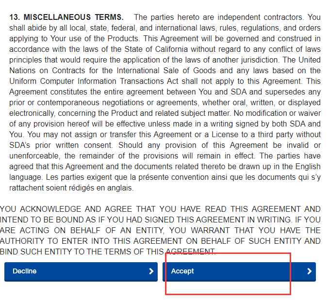
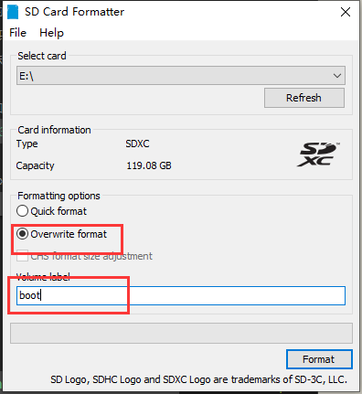
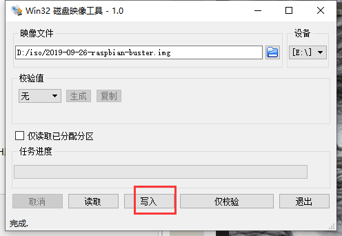

总操作流程：
- 1、[下载安装](#linux-01)
- 2、[烧写系统](#linux-02)
- 3、[测试](#linux-03)

***

## 下载安装 <a name="Linux-01" href="#" >:house:</a>

> 格式化工具：SD card formatter

[](https://www.sdcard.org/downloads/formatter/eula_windows/index.html)



> 烧制工具：Win32 Disk Imager

[](https://sourceforge.net/projects/win32diskimager/files/latest/download)

> raspbian系统

[](https://www.raspberrypi.org/downloads/raspbian/)

## 烧写系统 <a name="Linux-02" href="#" >:house:</a>

> 使用格式化工具格式sd卡



> 烧写系统


- 烧写成功后，在boot/的下创建文件“ssh”

>配置。 插入sd卡后，开启

- 修改root的密码

```

初始账号：pi
初始密码：raspberry

sudo passwd
```

- 默认账号pi的密码

```
sudo passwd pi
```

- 获取ip

```
ifconfig
```

## 测试 <a name="Linux-03" href="#" >:house:</a>

> 使用ssh远程工具连接pi的账号

- 注意：远程拉取文件下来需要将文件权限授予pi账号

```
chown -R pi 文件名
chmod 0777 文件名
```

