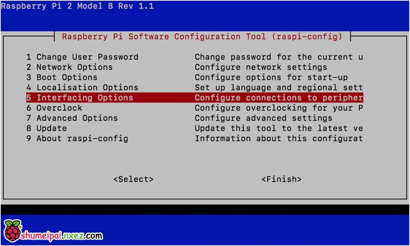
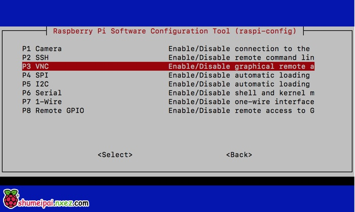
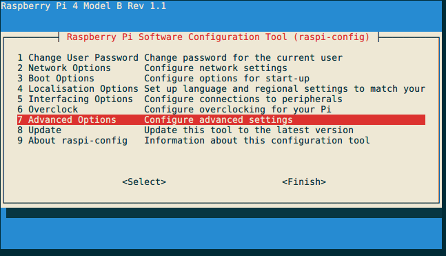
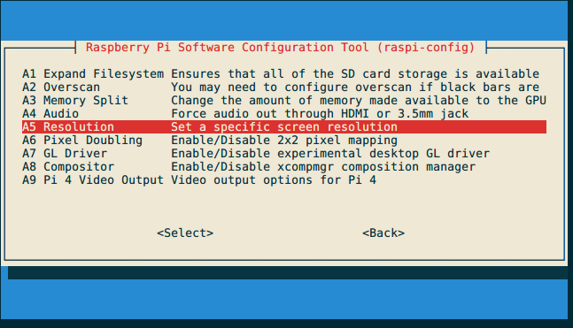
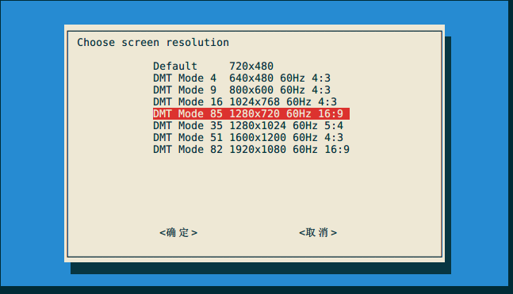

总操作流程：
- 1、[下载安装](#Linux-01)
- 2、[测试](#Linux-02)

***

## 下载安装 <a name="Linux-01" href="#" ></a>

> 1、下载

[](https://www.realvnc.com/en/connect/download/vnc/raspberrypi/)


[](https://www.realvnc.com/en/connect/download/viewer/windows/)

> 2、raspberrypi安装服务端

<details>
<summary>命令</summary>

```shell
su

# 上传下载好的realvn的server
cd /home/pi

dpkg -i VNC-Server-*

# 注册
vnclicense -add FBV9V-7Z3V9-MED3U-47SEU-85T3A

#设置开机启动
systemctl enable vncserver-virtuald.service

# 开启服务
systemctl start vncserver-virtuald.service

# 开启
service vncserver-x11-serviced start

# 启用树莓派 VNC 服务
sudo raspi-config

```

</details>











> 3、win直接安装点击安装就行

## 测试 <a name="Linux-02" href="#" ></a>

使用viewer连接server就行


