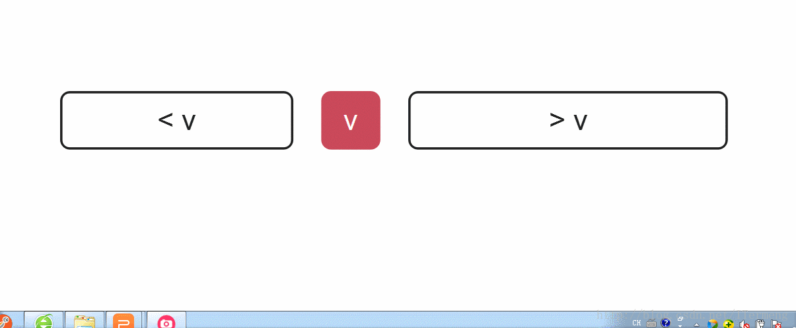
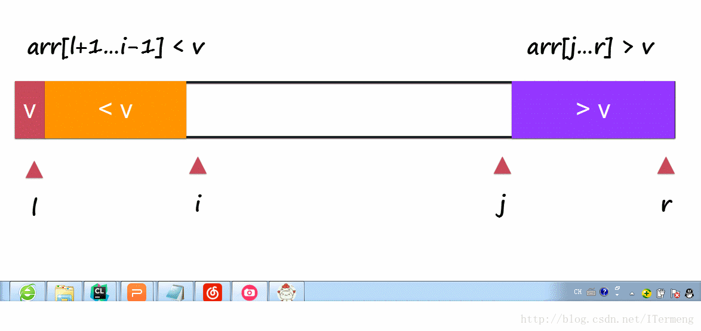

[](https://blog.csdn.net/ITermeng/article/details/77397212)


本页目录：
- 1、[二路快速排序](#fast-01)
    - 1.[1、应用场景](#fast-01-01)
    - 1.[2、工作原理](#fast-01-02)
    - 1.[3、代码实现](#fast-01-03)
- 2、[三路快速排序](#fast-02)
    - 2.[1、应用场景](#fast-02-01)
    - 2.[2、工作原理](#fast-02-02)
    - 2.[3、代码实现](#fast-02-03)
    
***

## 二路快速排序 <a name="fast-01" href="#" >:house:</a>
### <a name="fast-01-01" href="#" >1、应用场景</a>
`
适用于：大规模的数据排序，数组中元素重复少的场景
`
### <a name="fast-01-02" href="#" >2、工作原理</a>
```
1、取第一个元素做准基数，创建一个j（一开始在数组第一位）做大于小于准基数的界线标志。
2、数组从第2个元素开始扫描，每个元素与准基数比较：
   当大于准基数时，继续向右扫描；
   当小于准基数时，j进一位，数值与下标为j（进位后的）数值交换；
   直到遍历的完时，第一位元素（准基数）与下标为j数值交换；
目的;将小于准基数的数放到其左边，大于放到右边；
3、继续对左右数组分别实现以上操作
```


### <a name="fast-01-03" href="#" >3、代码实现</a>
- java代码
```java
public class Main {

    /**
     * 取第一个元素做准基数，小于的放左边，大于放右边。
     * @param arr
     * @param l
     * @param r
     * @return 返回大于准基数与小于准基数的界线（标志）
     */
    public static int __partition(int arr[], int l, int r){
        int v = arr[l];//取第一个做准基数
        int j = l;//创建界线标志
        for( int i = l + 1 ; i < r ; i ++ ){//从第二个元素开始遍历。将小于准基数的放到j的左边，大于放右边。
            if( arr[i] < v ){
                j ++;
                swap(arr, j , i );
            }
        }
        swap( arr,l , j);//将准基数放到数组中间
        return j;
    }

    /**
     * 对左右两边的数组递归再次进行快速排序
     * @param arr
     * @param l
     * @param r
     */
    public static void __quickSort(int arr[], int l, int r){
        if( l >= r )
            return;
        int p = __partition(arr, l, r);//获取界线的标签
        __quickSort(arr, l, p-1 );//递归左边的数组
        __quickSort(arr, p+1, r);//递归右边的数组
    }

    /**
     * 交换位置
     * @param a
     * @param b
     */
    public static void swap(int arr[],int a, int b){
        int temp;
        temp = arr[a];
        arr[a]= arr[b];
        arr[b]=temp;
    }

    public static void main(String[] args) {
        int[] arr = {1,1,2,0,9,3,12,7,8,3,4,65,22};
        System.out.print("排序前：");
        for(int i:arr){
            System.out.print(i+",");
        }
        System.out.println();
        System.out.print("排序后：");
        __quickSort(arr, 0,arr.length);
        for(int i:arr){
            System.out.print(i+",");
        }
    }
}
```
- c代码
```c
#include <stdio.h>

/**
  * 取第一个元素做准基数，小于的放左边，大于放右边。
  * @param arr
  * @param l
  * @param r
  * @return 返回大于准基数与小于准基数的界线（标志）
  */
int __partition(int arr[], int l, int r){
    int v = arr[l];//取第一个做准基数
    int j = l;//创建界线标志
    for( int i = l + 1 ; i < r ; i ++ ){//从第二个元素开始遍历。将小于准基数的放到j的左边，大于放右边。
        if( arr[i] < v ){
            j ++;
            swap(&arr[j] , &arr[i] );
        }
    }
    swap( &arr[l] , &arr[j]);//将准基数放到数组中间
    return j;
}
/**
* 对左右两边的数组递归再次进行快速排序
* @param arr
* @param l
* @param r
*/
void __quickSort(int arr[], int l, int r){
    if( l >= r )
        return;
    int p = __partition(arr, l, r);//获取界线的标签
    __quickSort(arr, l, p-1 );//递归左边的数组
    __quickSort(arr, p+1, r);//递归右边的数组
}
/**
 * 交换位置
 * @param a
 * @param b
 */
void swap(int *a, int *b){
    int temp;
    temp = *a;
    *a= *b;
    *b=temp;
}

int main() {
    int arr[] = {1,1,2,0,9,3,12,7,8,3,4,65,22};
    int arrLength=sizeof(arr)/sizeof(arr[0]);
    printf("排序前：");
    for(int i=0;i<arrLength;i++){
        printf("%d,",arr[i]);
    }
    printf("\n");

    printf("排序后：");
    __quickSort(arr,0,arrLength);
    for(int i=0;i<arrLength;i++){
        printf("%d,",arr[i]);
    }
    return 0;
}
```
## 三路快速排序 <a name="fast-02" href="#" >:house:</a>
### <a name="fast-02-01" href="#" >1、应用场景</a>
`
适用于：大规模的数据排序，数组中元素重复多（0~10范围内50万个数）的场景
`
### <a name="fast-02-02" href="#" >2、工作原理</a>
```
1、取第一个元素做准基数，创建一个lt（一开始在数组第一位）,创建一个gt（数组长度+1），做大于小于准基数的界线标志。
2、数组从第2个元素开始扫描，每个元素与准基数比较：
       当小于准基数时，lt进一位，数值与下标为lt（进位后的）数值交换；
       当大于准基数时，gt退一位，数值与下标为gt（退位后的）数值交换；
       当等于准基数时，继续向后扫描；
       直到扫描的位置等于gt，第一位元素（准基数）与下标为lt数值交换；。
目的：将小于准基数的数放到其左边，大于放到右边，等于的放中间；
3、继续对左右数组分别实现以上操作
```


### <a name="fast-02-03" href="#" >3、代码实现</a>
- java代码
```java
public class test {

    /**
     * 取第一个元素做准基数，小于的放左边，大于放右边。
     * @param arr
     * @param l
     * @param r
     * @return 返回大于准基数与小于准基数的界线（标志）
     */
    public static void __partition(int arr[], int l, int r){
        if(l>=r)
            return;
        int v = arr[l];//取第一个做准基数
        int lt = l;
        int gt = r;
        int i = l+1;
        while( i < gt ){
            if( arr[i] < v ){
                lt ++;
                swap(arr, i , lt );
                i ++;
            }
            else if( arr[i] > v ){
                gt--;
                swap(arr, i , gt );
            }
            else{ // arr[i] == v
                i ++;
            }
        }
        swap( arr,l , lt );

        __partition(arr, l, lt);//左边递归
        __partition(arr, gt, r);//右边递归
    }


    /**
     * 交换位置
     * @param a
     * @param b
     */
    public static void swap(int arr[],int a, int b){
        int temp;
        temp = arr[a];
        arr[a]= arr[b];
        arr[b]=temp;
    }


    public static void main(String[] args) {
        int[] arr = {1,1,2,0,9,3,3,3,3,3,3,3,3,3,3,12,7,8,3,7,8,7,8,7,8,7,8,7,8,7,8,7,8,4,65,22};
        System.out.print("排序前：");
        for(int i:arr){
            System.out.print(i+",");
        }
        System.out.println();
        System.out.print("排序后：");
        __partition(arr, 0,arr.length);
        for(int i:arr){
            System.out.print(i+",");
        }
    }
}

```
- c代码
```c
#include <stdio.h>

/**
  * 取第一个元素做准基数，小于的放左边，大于放右边。
  * @param arr
  * @param l
  * @param r
  * @return 返回大于准基数与小于准基数的界线（标志）
  */
void __partition(int arr[], int l, int r){
    if(l>=r)
        return;
    int v = arr[l];//取第一个做准基数
    int lt = l;
    int gt = r;
    int i = l+1;
    while( i < gt ){
        if( arr[i] < v ){
            lt ++;
            swap(&arr[i] , &arr[lt] );
            i ++;
        }
        else if( arr[i] > v ){
            gt--;
            swap(&arr[i] , &arr[gt] );
        }
        else{ // arr[i] == v
            i ++;
        }
    }
    swap( &arr[l] , &arr[lt] );

    __partition(arr, l, lt);//左边递归
    __partition(arr, gt, r);//右边递归
}
/**
 * 交换位置
 * @param a
 * @param b
 */
void swap(int *a, int *b){
    int temp;
    temp = *a;
    *a= *b;
    *b=temp;
}

int main() {
    int arr[] =  {1,1,2,0,9,3,3,3,3,3,3,3,3,3,3,12,7,8,3,7,8,7,8,7,8,7,8,7,8,7,8,7,8,4,65,22};
    int arrLength=sizeof(arr)/sizeof(arr[0]);
    printf("排序前：");
    for(int i=0;i<arrLength;i++){
        printf("%d,",arr[i]);
    }
    printf("\n");

    printf("排序后：");
    __partition(arr,0,arrLength);
    for(int i=0;i<arrLength;i++){
        printf("%d,",arr[i]);
    }
    return 0;
}
```